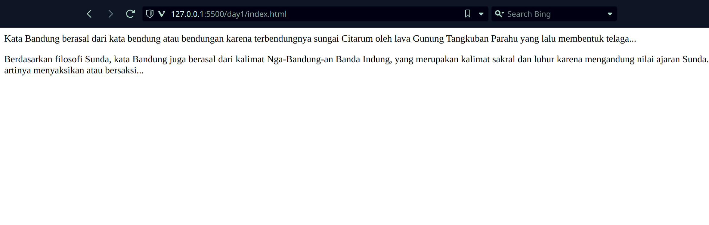
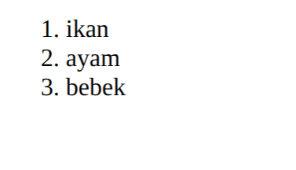

# This is going to be my process of learning to be a frontend developer
# What is HTML
- HTML stands for Hyper Text Markup Language
- HTML is the standard markup language for creating Web pages
- HTML describes the structure of a Web page
- HTML consists of a series of elements
- HTML elements tell the browser how to display the content
- HTML elements label pieces of content such as "this is a heading", "this is a paragraph", "this is a link", etc.
# Structure  of Web

- html
- head
- body
- html
# What we want to learn for today
## Lets talk about paragraph
the symbol : ```<p></p>```
```<p>This is a paragraph.</p>```


## Examples of heading


## List
two type of of common list:
- Unordered list
```<ul></ul>```

nested 
- Ordered list
```<ol></ol>```

> [W3 Schools]: https://www.w3schools.com/html/html_intro.asp
